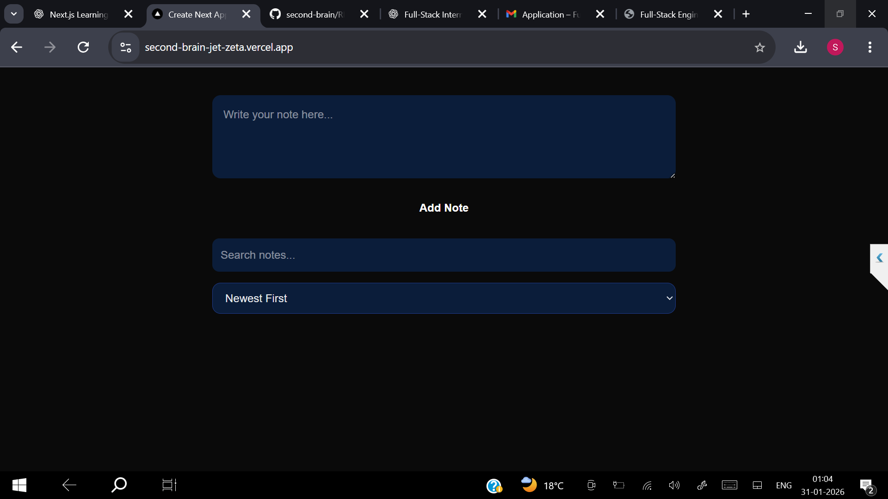
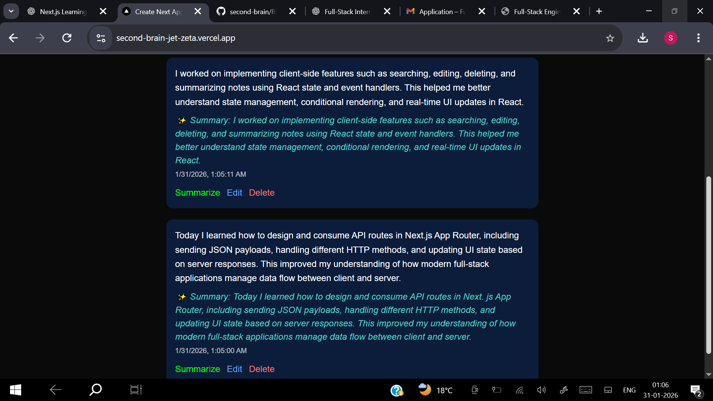
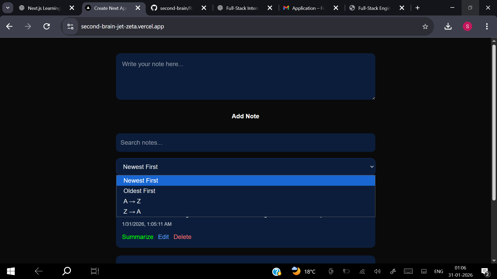

# 🧠 Second Brain — AI-Powered Knowledge System

A modern **AI-powered full-stack note-taking and knowledge management system** built with **Next.js App Router**, designed to act as your personal *second brain*.  
It enables structured thinking through notes, summaries, tags, and intelligent organization — all with a clean, elegant UI.

**Tagline:** _“Capture thoughts. Organize knowledge. Think better.”_

---

## 🌟 Features

- 📝 **Rich Note Management**
  - Create, edit, delete notes
  - Timestamped entries
  - Clean, distraction-free writing experience

- ✨ **AI-Assisted Summarization**
  - One-click summary generation per note
  - Helps condense long thoughts into key insights

- 🏷️ **Smart Tag Display**
  - Notes support structured tags
  - Tags are rendered visually for better categorization

- 🔍 **Search & Sorting**
  - Real-time text search across notes
  - Sort by newest, oldest, A→Z, Z→A

- 🎞️ **Delightful UI & Motion**
  - Smooth card animations using Framer Motion
  - Micro-interactions on hover and actions
  - Skeleton-style loading state

- 💾 **Persistent Storage**
  - SQLite database for fast, local persistence
  - Fully managed via backend API routes

- ⚙️ **Modern Full-Stack Architecture**
  - Next.js App Router
  - API routes for all CRUD operations
  - Clean separation of UI and data logic

---

## 🤖 AI Usage in Second Brain

Second Brain uses AI thoughtfully to **augment human thinking**, not replace it.

### Current AI Capabilities
- **Note Summarization**
  - Converts long-form notes into concise summaries
  - Helps with revision, recall, and clarity

### Design Philosophy
- AI is **assistive**, not intrusive
- User remains fully in control of content
- No background automation without intent

> The project is intentionally designed to be extensible for future AI features like conversational search, embeddings, or semantic recall.

---

## 🧱 Tech Stack

### Frontend
- **Next.js (App Router)**
- **React**
- **Framer Motion** (animations)
- **CSS / Inline Styling**

### Backend
- **Next.js API Routes**
- **Node.js Runtime**
- **SQLite** (lightweight, file-based DB)

### Tooling & Dev
- Git & GitHub
- ESLint
- Environment variables via `.env.local`

---

## 📁 Project Structure

```bashsecond-brain/
├── src/
│ ├── app/
│ │ ├── page.js # Main UI
│ │ ├── layout.js # App layout
│ │ ├── globals.css
│ │ └── api/
│ │ ├── notes/
│ │ │ └── route.js # Notes CRUD API
│ │ └── summarize/
│ │ └── route.js # AI summary API
│ └── lib/
│ └── db.js # SQLite database logic
├── notes.db # SQLite database file
├── .env.local # Environment variables
├── package.json
└── README.md
```


---

## 🚀 Getting Started

### 1. Clone the repository

```bash
git clone https://github.com/Sattvic27/second-brain.git
cd second-brain
```

### 2. Install dependencies
```bash
npm install
```

### 3. Environment Variables

Create a `.env.local` file in the root 
```bash
GEMINI_API_KEY=your_api_key_here
```

### 4. Run the development server
`npm run dev`

App runs at:
`http://localhost:3000`

---

## 🗄️ Database

Uses SQLite
- Stored locally as notes.db
- Automatically initialized on first run
- No manual migration required
  
Stored Data
- Notes content
- Summaries
- Tags
- Creation timestamps

---

## 🔌 API Endpoints

Notes

| Method | Endpoint     | Description           |
| ------ | ------------ | --------------------- |
| GET    | `/api/notes` | Fetch all notes       |
| POST   | `/api/notes` | Create a new note     |
| PATCH  | `/api/notes` | Update note / summary |
| DELETE | `/api/notes` | Delete a note         |

Summarization

| Method | Endpoint         | Description         |
| ------ | ---------------- | ------------------- |
| POST   | `/api/summarize` | Generate AI summary |

---

## 🎨 UI / UX Principles

- Minimalist & Focused
- Clear visual hierarchy
- Motion used to guide attention
- Desktop-first, mobile-friendly layout
- Intentional hover & interaction states
The UI is designed to feel calm, thoughtful, and reliable — mirroring how a second brain should feel.

---

## 🧩 Screenshots

*Note: The data shown in the screenshots below is pre-inserted for demonstrating features and ensuring a clear visual representation.*

### Home Page  



---

### Note ADD Page


---

### Note Edit Page


---

### Note Delete Page


---

### Note Summary Page



---

### Filtering Page



---

### Sorting Page


---

## Future Enhancements (Planned)

- Conversational AI search
- Semantic recall using embeddings
- Knowledge graph visualization
- Cloud database (Supabase / Neon)
- Auth & multi-user support

  ---

  ## 👨‍💻 Developer

**Satvik Nagare** <br>Full-Stack Developer <br>📍 India
- GitHub: https://github.com/Sattvic27
- Project: Second Brain

---

## 📄 License

This project is licensed under the MIT License.

---

📝 Notes

- Designed as a portfolio-grade full-stack project
- Emphasizes clarity, architecture, and UX polish
- Built to demonstrate real-world engineering judgment


